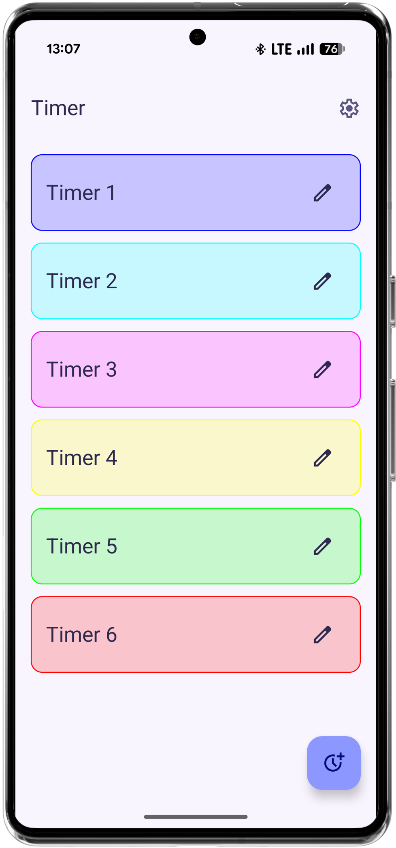
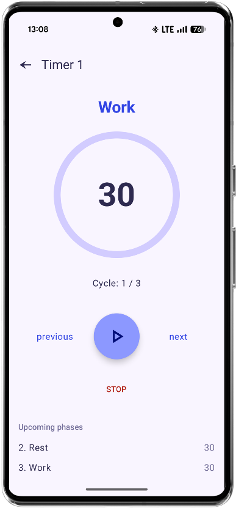
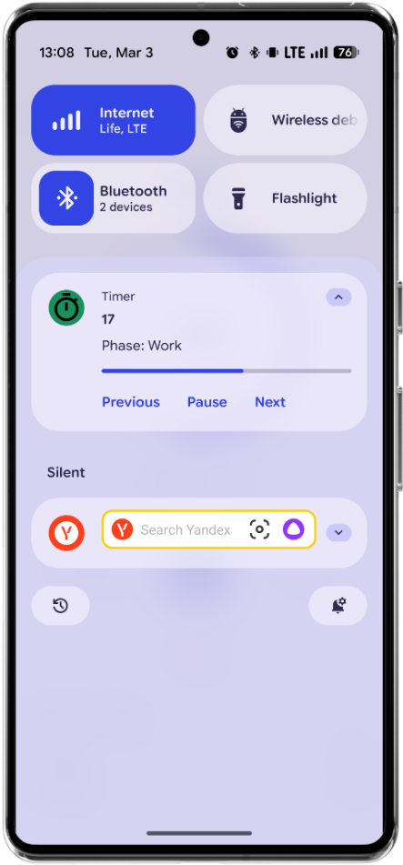
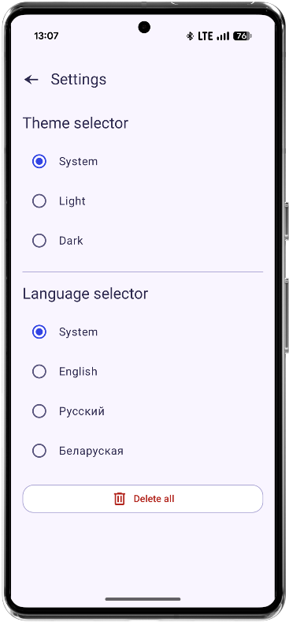

## About the Project

This is an Android timer app for interval routines. You can create custom timer sequences with multiple phases (for example warm-up, work, rest, and cooldown), set repeat count, and run them with simple controls.

The timer works through a foreground service, so it can continue in the background with notifications. The app also supports theme and language settings.

## Tech Stack

- Kotlin
- Jetpack Compose (Material 3)
- Navigation Compose
- Room + KSP
- DataStore Preferences
- Koin (dependency injection)
- Kotlin Coroutines + Flow
- Foreground Service + Notifications

## Screenshots

  

  

  

  

  

